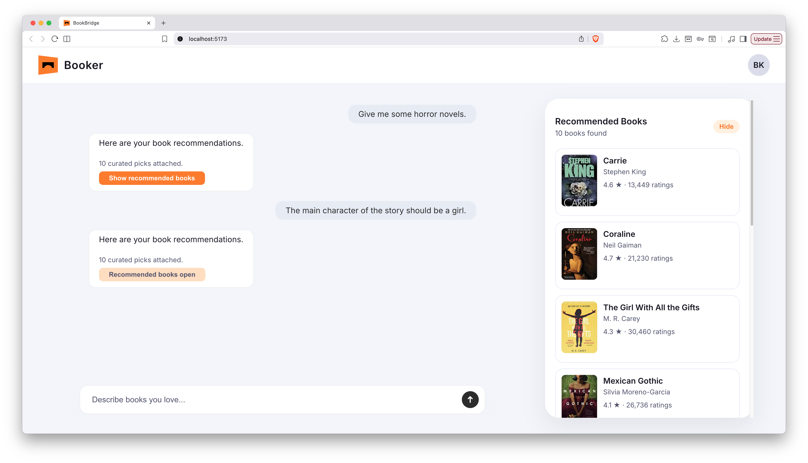

# BookBridge

## Project Overview
BookBridge is an end-to-end book recommender that pairs a conversational web UI with a FastAPI backend and a hybrid LLM + item2vec ranking pipeline. Users describe what they want to read, the frontend streams the request to the API, the backend generates semantic candidates with OpenAI, reranks them with item2vec embeddings trained on Amazon reviews, enriches the results with catalog metadata, and returns curated picks back to the chat experience.

**Workflow in practice**
- Web UI captures a reader’s prompt and prior chat turns, then POSTs to `/recommendations`.
- Backend validates the request, calls OpenAI (`gpt-4.1-mini`) to propose ordered book titles, normalizes them against the catalog, and boosts similar titles with item2vec embeddings.
- Reranked ASINs are joined to rich metadata (title, author, ratings, cover art) and delivered to the client.
- The chat window displays the AI reply and a recommendation drawer; users can reopen past recommendation sets and drill into book details.

## Features
- Frontend chat UI for book recommendation queries with responsive layout and modal book detail view.
- Integration with a backend API (`/recommendations`) that encapsulates the recommendation pipeline.
- LLM-based semantic candidate generation via OpenAI to interpret free-form reader intents.
- Item2Vec reranking pipeline that expands seeds, scores neighbors, and returns the global top-K.
- Retrieval workflow combining LLM title candidates with item2vec similarity and catalog metadata resolution.
- Caching and context storage: chat context/history persisted in the client; backend caches title index, embeddings, and metadata in memory and on disk to avoid repeated GCS pulls.
- End-to-end book recommendation logic that maps prompts → candidate titles → ASINs → enriched results.
- ETL process from raw data: PySpark job builds the item2vec training corpus and filtered metadata from Amazon review and metadata dumps, targeting GCS for storage and Dataproc for scale.

## Tech Stack
- **Frontend**: React 18 + TypeScript (Vite), context-based state for chat/messages/recommendation history, Axios for API calls, CSS modules for the chat window, message bubbles, recommendation panel, and modal detail views.
- **Backend/API**: FastAPI + Pydantic for routing/validation, CORS-enabled; Dockerfile for containerized deployment; uvicorn entrypoint bound to `$PORT`.
- **Recommender/ML**: OpenAI Chat Completions (`gpt-4.1-mini`) for semantic candidate generation; gensim item2vec embeddings for similarity expansion and reranking; catalog mapping via a normalized title index; metadata hydration with cover images and ratings.
- **Data & Infra**: PySpark ETL (`Backend/etl/BookBridgeETL.py`) to build training sequences and filtered metadata; Google Cloud Storage for model assets and metadata; Dataproc for scalable Spark runs; lightweight caching in `/tmp/bookbridge_cache` for API-serving environments.
- **Tooling**: `python-dotenv` for configuration, pytest for backend testing, JupyterLab notebooks for exploration, TypeScript compiler for linting the frontend.

## License
MIT
