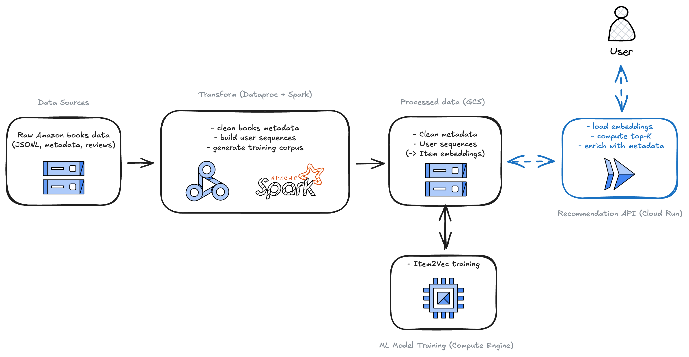

# BookBridge
Your AI reading concierge: describe a vibe, and BookBridge answers with curated picks, cover art, and context in one chat flow.

**Why this is special**
- Hybrid LLM + item2vec pipeline: semantic ideas become grounded ASINs with personalization-friendly reranking.
- Built for product velocity: React chat UI, FastAPI backend, and cached assets so responses stay snappy.
- Data-native from day one: PySpark ETL on Amazon reviews/metadata, ready for cloud-scale deploys.

## Product snapshots

## System architecture

## How recommendations are generated (fast)
1) Chat UI streams the reader prompt plus conversation context to `/recommendations`.
2) FastAPI validates the payload, then uses OpenAI (`gpt-4.1-mini`) to propose candidate titles.
3) Titles are normalized against the catalog and expanded with item2vec neighbors trained on Amazon reviews.
4) Candidates are reranked, joined with metadata (author, ratings, cover art), and cached.
5) The response returns both the AI reply and the curated recommendation set for the drawer/detail views.

## Feature highlights
- Conversational recommender UX with responsive layout and modal book details.
- Retrieval workflow that marries LLM title generation with item2vec similarity and catalog resolution.
- Client-side chat history and context persistence; backend caching of embeddings, indexes, and metadata to skip repeated GCS pulls.
- End-to-end path from raw prompt → candidates → ASINs → enriched results delivered in one response.
- PySpark ETL job to build the training corpus and filtered metadata for production storage (GCS/Dataproc ready).

## Tech stack
- **Frontend**: React 18 + TypeScript (Vite), context-based state for chat/messages/recommendation history, Axios for API calls, CSS modules for the chat window, message bubbles, recommendation panel, and modal detail views.
- **Backend/API**: FastAPI + Pydantic for routing/validation, CORS-enabled; Dockerfile for containerized deployment; uvicorn entrypoint bound to `$PORT`.
- **Recommender/ML**: OpenAI Chat Completions (`gpt-4.1-mini`) for semantic candidate generation; gensim item2vec embeddings for similarity expansion and reranking; catalog mapping via a normalized title index; metadata hydration with cover images and ratings.
- **Data & infra**: PySpark ETL (`Backend/etl/BookBridgeETL.py`) to build training sequences and filtered metadata; Google Cloud Storage for model assets and metadata; Dataproc for scalable Spark runs; lightweight caching in `/tmp/bookbridge_cache` for API-serving environments.
- **Tooling**: `python-dotenv` for configuration, pytest for backend testing, JupyterLab notebooks for exploration, TypeScript compiler for linting the frontend.

## License
Licensed under the MIT License. See `LICENSE` for details.
